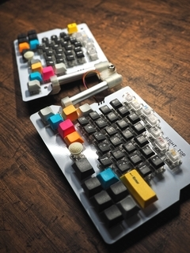

# Title
SSSM.NarrowCorsa firmware

# Overview
自作した分割キーボード用のファームウェア(Arduino)です。  
[SSSM.NarrowCorsa REV.E UNION-V7b](https://www.s-m-l.org/corsan.html#2024-07-22%20SSSM.NarrowCorsa%20REV.E%20UNIOV-V7b)  

# Description
Arduino環境のIOエクスパンダ(NXP PCA9555)を使用した分割キーボードファームウェアです。  
  
Firmware: Arduino  
PCB: [SSSM.NarrowCorsa REV.E](https://www.s-m-l.org/corsan.html#2024-05-30%20SSSM.NarrowCorsa%20REV.E)  
CPU: [Seeed XIAO RP2040](https://wiki.seeedstudio.com/XIAO-RP2040-with-Arduino/)  
IOエクスパンダ: NXP PCA9555

# ソフトウェア開発の準備

## Arduino IDE
[Arduino IDE](https://www.arduino.cc/en/software)  
  
開発環境  
同じバージョンにする必要はありませんが、参考までに記載しておきます。  
ArduinoIDE 2.3.2  
Raspberry Pi RP2040 Boards(3.6.3)

# ソフトウェア
## キーのカスタマイズ
キーのカスタマイズは、下記ファイルを変更します。  
keymap.cpp  
  
keymap_left[],keymap_right[]でキーを指定します。  
レイヤーはありません。  
ちょっと分かりづらいですが、ソースコードが単純になる事を優先しました。  

## ファームウェア書き込み
Arduino IDEを使用します。  
  
ボードマネージャで"Raspberry Pi RP2040 Boards"をインストール  
▼  
ボードを指定  
Tool -> Board -> Raspberry Pi Pico/RP2040 -> Seeed XIAO RP2040  
▼  
マイコンボードに書き込む  
Sketch -> Upload  

# 回路図
[回路図 IB136EL1_NarrowCorsa.pdf](image/IB136EL1_NarrowCorsa.pdf)  
  
  
  

# Licence
MIT License  
  
Copyright (c) 2024 Suns & Moon Laboratory  
  
Permission is hereby granted, free of charge, to any person obtaining a copy  
of this software and associated documentation files (the "Software"), to deal  
in the Software without restriction, including without limitation the rights  
to use, copy, modify, merge, publish, distribute, sublicense, and/or sell  
copies of the Software, and to permit persons to whom the Software is  
furnished to do so, subject to the following conditions:  
  
The above copyright notice and this permission notice shall be included in all  
copies or substantial portions of the Software.  
  
THE SOFTWARE IS PROVIDED "AS IS", WITHOUT WARRANTY OF ANY KIND, EXPRESS OR  
IMPLIED, INCLUDING BUT NOT LIMITED TO THE WARRANTIES OF MERCHANTABILITY,  
FITNESS FOR A PARTICULAR PURPOSE AND NONINFRINGEMENT. IN NO EVENT SHALL THE  
AUTHORS OR COPYRIGHT HOLDERS BE LIABLE FOR ANY CLAIM, DAMAGES OR OTHER  
LIABILITY, WHETHER IN AN ACTION OF CONTRACT, TORT OR OTHERWISE, ARISING FROM,  
OUT OF OR IN CONNECTION WITH THE SOFTWARE OR THE USE OR OTHER DEALINGS IN THE  
SOFTWARE.

# Author
Suns & Moon Laboratory  
https://www.s-m-l.org  
https://twitter.com/mikekoma  
